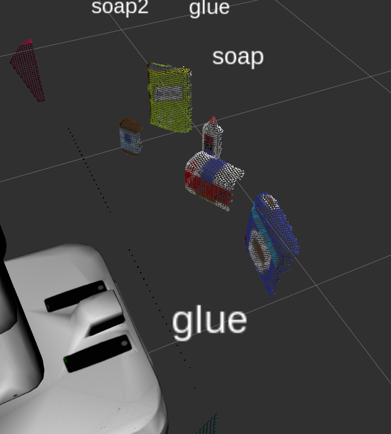

## Project: Perception Pick & Place

---

Welcome to my writeup for the third Udacity RoboND Project, 3D Perception!

The aim of the project was to learn and apply robot 3D perception techniques and implement them in a pipeline that was able to identify sets of objects in a simulated world. To do this, we needed to use filtering functions and machine learning classifier algorithms such as the Support Vector Machine. Finally the data from the identified objects was passed to a ROS Server for the pick and place function to be carried out (note actual picking / placing was an optional task which I chose not to undertake due to time constraints).

In this repo can be found all required code as well as the output yaml files. Please see annotated code below for additional thought processes and information which may not be included in the attached .py documents.   

### Exercise 1, 2 and 3 pipeline implemented

### 1. Complete Exercise 1 steps. Pipeline for filtering and RANSAC plane fitting implemented.


```python
# TODO: Convert ROS msg to PCL data
	msg_to_pcl =  ros_to_pcl(pcl_msg)   
# TODO: Statistical Outlier Filtering
	# We start by creating a filter object: 
	outlier_filter = msg_to_pcl.make_statistical_outlier_filter()
	# Set the number of neighboring points to analyze for any given point. The larger the value of k
    # and so the more surrounding points considered by the function, the less effective the filter was
	outlier_filter.set_mean_k(5)
	# Set threshold scale factor. Here a smaller threshold helped 'clean up' the final generated clusters
    # and give them a more defined edge.
	x = 0.000000001
	# Any point with a mean distance larger than global (mean distance+x*std_dev) will be considered outlier
	outlier_filter.set_std_dev_mul_thresh(x)
	# Finally call the filter function for magic
	msg_to_pcl = outlier_filter.filter()


# TODO: Voxel Grid Downsampling
	vox = msg_to_pcl.make_voxel_grid_filter()
    #The leaf size dictates the volume of each voxel. I set the size to the smallest allowable as this made
    #my pipeline robust over all three worlds.
	LEAF_SIZE = 0.006
	vox.set_leaf_size(LEAF_SIZE, LEAF_SIZE, LEAF_SIZE)
	cloud_filtered = vox.filter()


# TODO: PassThrough Filter Z. This is the standard passthrough given in the class and works in the 
# 'vertical' axis, allowing us to remove extraneous part of the table from consideration.
	passthroughZ = cloud_filtered.make_passthrough_filter()
	filter_axis = 'z'
	passthroughZ.set_filter_field_name(filter_axis)
    #The numbers for min and max allowed me to focus on the objects better without potentially excluding
    #any cloud points belonging to the objects. However this did lead to some voxels remaining in view
    #from the thin vertical edge of the table.
	axis_min = 0.598
	axis_max = 1.1
	passthroughZ.set_filter_limits(axis_min, axis_max)
	cloud_filtered = passthroughZ.filter()
    
	# Passthrough filter X to remove appearance of bin edges
    # Adding the x axis filter allowed me to remove the table edge excess mentioned above as well as exclude the
    #visible edges of the dropboxes.
	passthroughX = cloud_filtered.make_passthrough_filter()
	filter_axis = 'x'
	passthroughX.set_filter_field_name(filter_axis)
	axis_min = 0.35
	axis_max = 3.6
	passthroughX.set_filter_limits(axis_min, axis_max)
	cloud_filtered = passthroughX.filter()
    
# TODO: RANSAC Plane Segmentation
	seg = cloud_filtered.make_segmenter()
	#Use the model for the plane to exclude the surface of the table.
    seg.set_model_type(pcl.SACMODEL_PLANE)
	seg.set_method_type(pcl.SAC_RANSAC)
    #Setting max distance fairly small to help prevent losing points belonging to other objects.
	max_distance = 0.0075
	seg.set_distance_threshold(max_distance)
    
# TODO: Extract inliers and outliers. Here we separate the objects from the table surface and create two new 
# point clouds, cloud_table and cloud_objects:
	inliers, coefficients = seg.segment()
	extracted_inliers = cloud_filtered.extract(inliers, negative=False)
	extracted_outliers = cloud_filtered.extract(inliers, negative=True)
	cloud_table = extracted_inliers
	cloud_objects = extracted_outliers
```

## Illustration of effects of point cloud filters and their parameter settings:

### Outlier Filter

Here is a shot without any outlier (noise) filtration. The perception pipeline is unable to separate out clusters due to the extensive overlap of meaningful point cloud data with noise:


Here the filter is active, but the value of k, which sets how many surrounding points to take into account when establishing which points are unwanted, is too high:


Now, using a value of k=5, we can see that the image is much cleaner and the pipeline can identify the objects:


Increasing the value of x (the tolerance) further cleans up the cloud and produces well defined clusters in conjunction with the rest of the pipeline:


### Voxel Grid Filter

The purpose of the voxel grid filter is to reduce the number of points to be processed by the pipeline. To this end, changing the value of the leaf size affects the density of the point cloud we want to use in our pipeline:

Leaf size = 0.01


Below: Leaf size = 0.006. Note that the pipeline for this world has identified all the objects correctly with LEAF_SIZE = 0.01, however I chose the finer leaf size of 0.006 as it made detection for all worlds more robust:


### Passthrough filters:

The aim of the passthrough filter is to eliminate parts of the pointcloud from consideration, in this case the legs and egde of the table, as well as the dropboxes at the far edges of the image. It is critical to set the axes values correctly so as not to exclude any wanted points or include any extraneous data. 

Here is what it looks like when the values are set wrongly. Some of the objects are cut off, like a bad photographer cutting people's heads out of a picture. We can also see too much of the table edge (black pixels):


Even with the z passthrough, we can still see the edges of the dropboxes. Additionally, as we do not want to set the z passthrough so close to the surface of the table that we begin to exclude point data that belongs to the bottom of our objects, we can still see some points from the table edge (black pixels). 



These can both be eliminated with a passthrough filter on the x axis (running left to right looking at the table and passing between the objects and the robot). 


## Plane Segmentation

Next we apply plane segmentation, and can use the PCL/Table topic in RVIZ to view the output just for the table surface:


## 2. Complete Exercise 2 steps: Pipeline including clustering for segmentation implemented.  


```python
# TODO: Euclidean Clustering
	white_cloud = XYZRGB_to_XYZ(cloud_objects)
# TODO: Create Cluster-Mask Point Cloud to visualize each cluster separately
	tree = white_cloud.make_kdtree()
	ec = white_cloud.make_EuclideanClusterExtraction()
    
# TODO: Convert PCL data to ROS messages
# Cluster tolerance is important - it helps the filter distinguish between two objects that may be close together:
	ec.set_ClusterTolerance(0.0500)
    #Setting Min cluster size correctly helps identifying smaller objects such as the glue 
	ec.set_MinClusterSize(50)
	ec.set_MaxClusterSize(5000)
	ec.set_SearchMethod(tree)
	cluster_indices = ec.Extract()
    
    #Assign a color corresponding to each segmented object in scene
	cluster_color = get_color_list(len(cluster_indices))
	color_cluster_point_list = []

	for j, indices in enumerate(cluster_indices):
		for i, indice in enumerate(indices):
			color_cluster_point_list.append([white_cloud[indice][0], 
										white_cloud[indice][1], 
										white_cloud[indice][2],
										rgb_to_float(cluster_color[j])])

    #Create new cloud containing all clusters, each with unique color
	cluster_cloud = pcl.PointCloud_PointXYZRGB()
	cluster_cloud.from_list(color_cluster_point_list)
```

With the correct sensitivities for the clustering function, we are able to identify small enough clusters for objects like the glue, and large enough clusters for objects such as the biscuits. 


### Perform object recognition on these objects and assign them labels (markers in RViz).


```python
    # Classify the clusters! (loop through each detected cluster one at a time)
	detected_objects_labels = []
	detected_objects = []
	for index, pts_list in enumerate(cluster_indices):    
        # Grab the points for the cluster
		pcl_cluster = cloud_objects.extract(pts_list)
		ros_cluster = pcl_to_ros(pcl_cluster)
		# Compute the associated feature vector. Here we call the histogram functions created earlier in the project
        #and which produce arrays of hsv PCL data for later fitting and object recognition
		chists = compute_color_histograms(ros_cluster, using_hsv=True)#ros_pcl_cluster, using_hsv=False)
		normals = get_normals(ros_cluster)#ros_pcl_cluster) as changed above    
		nhists = compute_normal_histograms(normals)
		feature = np.concatenate((chists, nhists))
		
        # Make the prediction. 
		prediction = clf.predict(scaler.transform(feature.reshape(1,-1)))
		label = encoder.inverse_transform(prediction)[0]
		detected_objects_labels.append(label)
		
        # Publish a label into RViz
		label_pos = list(white_cloud[pts_list[0]])
		label_pos[2] += .4
		object_markers_pub.publish(make_label(label,label_pos, index))
		
		# Add the detected object to the list of detected objects. Uses DetectedObject.msg, a 
		# two line file that defines the msg fields
		do = DetectedObject()
		#Populate the msg fields
		do.label = label
		#Populate with cluster array
		do.cloud = ros_cluster
		#this is the detected objects list that we later compare the pick list to, outputs
		# format e.g. ['biscuits', 'soap'. 'soap2']
		detected_objects.append(do)
	#print('test = ', do.label)
    
	rospy.loginfo('Detected {} objects: {}'.format(len(detected_objects_labels), detected_objects_labels))
    # Publish the list of detected objects
	detected_objects_pub.publish(detected_objects)
    
    
    
    #Note that the data used for the classifier, such as clf and scaler, come from the clustering node, which
    #parses the model.sav file created by the training process:
if __name__ == '__main__':

    # TODO: ROS node initialization
	rospy.init_node('clustering', anonymous=True)
    # TODO: Create Subscribers
	pcl_sub = rospy.Subscriber("/pr2/world/points", pc2.PointCloud2, pcl_callback, queue_size=1)
    # TODO: Create Publishers
	detected_objects_pub = rospy.Publisher("/detected_objects", DetectedObjectsArray, queue_size=1)
	object_markers_pub = rospy.Publisher("/object_markers", Marker, queue_size=1)
	pcl_objects_pub = rospy.Publisher("/pcl_objects", PointCloud2, queue_size=1)
	pcl_table_pub = rospy.Publisher("/pcl_table", PointCloud2, queue_size=1)
	pcl_cluster_pub = rospy.Publisher("/pcl_cluster", PointCloud2, queue_size=1)    
    # TODO: Load Model From disk
	model = pickle.load(open('model.sav', 'rb'))
	clf = model['classifier']
	encoder = LabelEncoder()
	encoder.classes_ = model['classes']
	scaler = model['scaler']
    # Initialize color_list
	get_color_list.color_list = []

    # TODO: Spin while node is not shutdown
	while not rospy.is_shutdown():
		rospy.spin()
```

## Screenshots of accurately identified objects for all three standard test worlds:

World 1, 100% identified (clusters shown)


World 1, 100% identified (objects shown)


World 2, 100% identified (clusters shown)


World 2, 100% identified (objects shown)


World 3, 100% identified (clusters shown)


World 3, 100% identified (objects shown)


#### 3. Complete Exercise 3 Steps.  Features extracted and SVM trained.  Object recognition implemented.

Below is the code used to generate the color histograms from the point cloud. I decided to use the voxel downsampling to make the clouds used in processing smaller. This allowed me to do 1000 pose-per-object training runs without it taking a prohibitive amount of time. Accuracy in the confusion matrix test was improved by 3 percentage points by doing so.


```python
def compute_color_histograms(cloud, using_hsv=True):
    #apply voxel grid downsampling to improve speed of data acquisition:
    cloud = ros_to_pcl(cloud)
    vox = cloud.make_voxel_grid_filter()
    LEAF_SIZE = 0.006
    vox.set_leaf_size(LEAF_SIZE, LEAF_SIZE, LEAF_SIZE)
    cloud = vox.filter()
    cloud = pcl_to_ros(cloud)

    # Compute histograms for the clusters
    point_colors_list = []

    # Step through each point in the point cloud
    for point in pc2.read_points(cloud, skip_nans=True):
        rgb_list = float_to_rgb(point[3])
        if using_hsv:
            point_colors_list.append(rgb_to_hsv(rgb_list) * 255)
        else:
            point_colors_list.append(rgb_list)

    # Populate lists with color values
    channel_1_vals = []
    channel_2_vals = []
    channel_3_vals = []

    for color in point_colors_list:
        channel_1_vals.append(color[0])
        channel_2_vals.append(color[1])
        channel_3_vals.append(color[2])
    

    # TODO: Compute histograms
	nbins = 32
	bins_range = (0, 256)
	ch_1 = np.histogram(channel_1_vals, bins=nbins, range=bins_range)
	ch_2 = np.histogram(channel_2_vals, bins=nbins, range=bins_range)
	ch_3 = np.histogram(channel_3_vals, bins=nbins, range=bins_range)

 #    # TODO: Concatenate and normalize the histograms
    ch_features = np.concatenate((ch_1[0], ch_2[0], ch_3[0])).astype(np.float64)    
  
    # Replace normed_features with your feature vector
    normed_features = ch_features / np.sum(ch_features) 
    return normed_features 
```

For the normal histograms I was not able to use the voxel downsampling due to data problems I was unable to solve. However the gains from using it with the colour section above meant that data acquisition was still much faster.


```python
def compute_normal_histograms(normal_cloud):

    # Compute histograms for the clusters
    point_colors_list = []
    norm_x_vals = []
    norm_y_vals = []
    norm_z_vals = []

    #normal_cloud changed to normal_cloud_vox
    for norm_component in pc2.read_points(normal_cloud,
                                          field_names = ('normal_x', 'normal_y', 'normal_z'),
                                          skip_nans=True):
        norm_x_vals.append(norm_component[0])
        norm_y_vals.append(norm_component[1])
        norm_z_vals.append(norm_component[2])
       


    # TODO: Compute histograms of normal values (just like with color)
	nbins = 32
	#Note this range can be -1, 1 or 0, 256. -1, 1 seems to work better with bayes
	bins_range = (0, 256)
	x = np.histogram(norm_x_vals, bins=nbins, range=bins_range)
	y = np.histogram(norm_y_vals, bins=nbins, range=bins_range)
	z = np.histogram(norm_z_vals, bins=nbins, range=bins_range)

    # TODO: Concatenate and normalize the histograms
    xyz_features = np.concatenate((x[0], y[0], z[0])).astype(np.float64)

    # Replace normed_features with your feature vector
    normed_features = xyz_features / np.sum(xyz_features)

    return normed_features

```

## Training the svm

I experimented with a number of classifiers, including Naive Bayes, SVM(rbf) and SVM(linear). Bayes is reportedly a good choice for extensively overlapping objects as it performs better than SVM's under those conditions, however in my tests with the provided worlds, by far the best performance was with linear SVM and modest C values. Rbf could be somewhat hit or miss, with the possibility of over-fitting being the cause.

I was very happy with the performance of the linear classifier which allowed me to identify all objects in all worlds. It is likely that the high number of training poses contributed to this, though even at around 100 poses per object the classifier was still very effective. Identifying the glue in world 3 could be problematic on lower training counts however. The classifier gave an accuracy of 97% as illustrated below:


Despite the robust performance of the classifier, it was possible to cause it to fail by moving objects to be behind and very close to one another. Though it was possible to offset some of this by adjusting the cluster tolerance, there came a point where it was very hard for the pipeline to separate the objects. I had hoped that Naive Bayes would help in this situation however it did not. Leveraging its reportedly superior performance in overlapping situations is something that would be worth investigating to make the pipeline even more powerful.

### Pick and Place Setup

#### 1. For all three tabletop setups ('test_world'), perform object recognition, then read in respective pick list (pick_list_*.yaml). Next construct the messages that would comprise a valid 'PickPlace' request output them to yaml format.

The final step of the project involved outputting the centroids and correct arm / dropbox selection to a yaml file. The three output files are included with this repo. Here is the code needed to output the file (please see included code comments). Note that due to time constraints I chose not to pursue the actual pick and place step or any of the challenge worlds:


```python
def pr2_mover(object_list):
# TODO: Initialize variables
	dict_list = []
	labels = []
	centroids = [] # to be list of tuples (x, y, z)
# TODO: Get/Read parameters
	object_list_param = rospy.get_param('/object_list')
	dropbox_param = rospy.get_param('/dropbox')
    
# TODO: Loop through the pick list
# TODO: Parse parameters into individual variables
	obj_list_name_list = []
	obj_list_group_list = []

	for i in object_list_param:
		object_name = String()
		object_group = String()
		object_name.data = i['name']
		object_group.data = i['group']


# TODO: Assign the arm to be used for pick_place
		arm_name = String()
    #These steps parse the pick list and look for the group colour, which indicates
    #the correct arm to use:
		if i['group'] == 'red':
			arm_name.data = 'left'
		elif i['group'] == 'green':
			arm_name.data = 'right'
        
# TODO: Get the PointCloud for a given object and obtain it's centroid
		#for every object we detected ....
        for obj in object_list:
            #and if the label of the detected object matches our object in the pick list...
			if obj.label == object_name.data:
				#set the pick pose geometry message with the correct coords for the centroid:
				pick_pose = Pose() 
				labels.append(obj.label)
				points_arr = ros_to_pcl(obj.cloud).to_array()

				obj_centroid = np.mean(points_arr, axis=0)[:3]
				centroids.append(obj_centroid)	
            #remember to set asscalar in order to provide the expected native python float:
				pick_pose.position.x = np.asscalar(obj_centroid[0])
				pick_pose.position.y = np.asscalar(obj_centroid[1])
				pick_pose.position.z = np.asscalar(obj_centroid[2])
# TODO: Create 'place_pose' for the object
		for k in dropbox_param:
			if k['group'] == object_group.data:
				place_pose = Pose()
				#Again we create the ROS geometry message and populate it
				place_pose.position.x = (k['position'][0])
				place_pose.position.y = (k['position'][1])
				place_pose.position.z = (k['position'][2])

		#Create and correctly set the datatype for test_scene_num
        test_scene_num = Int32()
		test_scene_num.data = 2
        #create the yaml dict
		yaml_dict = make_yaml_dict(test_scene_num, arm_name, object_name, pick_pose, place_pose)

# TODO: Create a list of dictionaries (made with make_yaml_dict()) for later output to yaml forma
		dict_list.append(yaml_dict)		

# TODO: Rotate PR2 in place to capture side tables for the collision map
    # Not required, I am only focusing on outputting the yaml file

        # Wait for 'pick_place_routine' service to come up
		rospy.wait_for_service('pick_place_routine')

		try:
			pick_place_routine = rospy.ServiceProxy('pick_place_routine', PickPlace)

	 #        # TODO: Insert your message variables to be sent as a service request
			resp = pick_place_routine(test_scene_num, arm_name, object_name, pick_pose, place_pose)

		 	print ("Response: ",resp.success)

		except rospy.ServiceException, e:
		 	print "Service call failed: %s"%e

# TODO: Output your request parameters into output yaml file
#note the variable for test world is set appropriately each time
	yaml_filename = 'output2.yaml'

	send_to_yaml(yaml_filename, dict_list)
```

My pipeline was able to filter out noise, downsample the pointcloud, eliminate unwanted regions of the scene, conduct plane segmentation for the table and separate out the objects for identification, create separate, clear clusters for each object and finally, through a properly trained SVM, identify the correct object and create labels that were displayed in RVIZ.

If I were to take this project further, I would like to work on passing the yaml output to the pick place server so that it can carry out the pick place routine, however I did not have enough time to complete this part. I would also like to improve the capability of the pipeline so that it can handle overlapping and closely placed objects. I would also like to apply it to real world camera data, which would require the additional step of camera calibration and considering lighting conditions (depending on sensor type).
